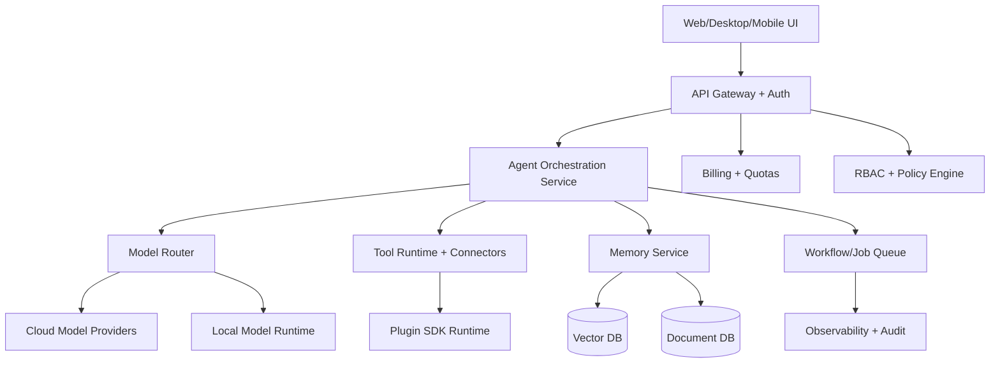

# Project Ascend AI / TRH AI
## Technical Architecture Specification (v0.1)

Date: 2026-08-01
Status: Draft

## 1) Purpose
Define a modular, secure, and scalable architecture for an AI Operating System that unifies assistant, coding, creator, business, automation, and team workflows under one control plane.

## 2) Product Principles
- User-controlled memory by default.
- Reliability over novelty for production workflows.
- Observable execution: every action logged, inspectable, and replayable.
- Hybrid compute: local-first option, cloud for heavy/elastic jobs.
- Capability isolation: sandbox tools, least-privilege permissions.

## 3) High-Level System

## 4) Core Services
### 4.1 API Gateway
Responsibilities:
- Unified API surface for clients and third-party integrations.
- Authentication (OIDC, API keys, service tokens).
- Request validation, rate limiting, tenant isolation.

Tech candidates:
- Node.js/TypeScript (Fastify/Nest) or Go (Fiber/Chi).
- Envoy/Nginx for edge + WAF.

### 4.2 Identity and Access Management (IAM)
Responsibilities:
- User auth, org/workspace memberships.
- Role-based access control (RBAC) and scoped permissions.
- Policy checks for sensitive actions.

Must-have roles:
- Owner, Admin, Member, Viewer, Billing Admin, Automation Operator.

### 4.3 Agent Orchestration Service
Responsibilities:
- Plan/execute loops for user tasks.
- Multi-agent decomposition (coding, business, media, gaming, legal-safe).
- Safety and policy checks before side-effect tools.
- Retries, timeouts, circuit breakers.

Design:
- Deterministic workflow engine for automations.
- Non-deterministic reasoning stage separated from side-effect stage.

### 4.4 Model Router
Responsibilities:
- Route by task type, latency budget, and cost profile.
- Fallback chains (cloud model A -> cloud model B -> local model).
- Model health scoring and dynamic traffic shifting.

Routing factors:
- Task category: reasoning, coding, image, video, speech, music.
- SLA profile: interactive vs batch.
- Security profile: local-only, region-locked, or cloud-allowed.

### 4.5 Memory Service
Memory domains:
- Personal memory
- Workspace memory
- Team shared memory

Responsibilities:
- Ingest and summarize events.
- Retrieval-augmented context assembly.
- User controls: pin, forget, export, lock, retention policy.

Storage split:
- Document DB: canonical memory records.
- Vector DB: semantic retrieval index.
- Object store: attachments and media artifacts.

### 4.6 Tool Runtime + Connectors
Responsibilities:
- Secure execution of actions (email, Slack, Discord, GitHub, cloud APIs).
- Adapter framework for built-in and marketplace plugins.
- Action preflight + post-action verification.

Security:
- Connector-specific OAuth scopes.
- Per-tool allowlists and workspace policies.
- Signed plugin manifests.

### 4.7 Workflow/Job Queue
Responsibilities:
- Long-running jobs (video rendering, batch coding, automation chains).
- Idempotent execution with exactly-once semantics where possible.
- Dead-letter queue and replay controls.

### 4.8 Billing + Metering
Responsibilities:
- Track token usage, generation jobs, storage, API calls.
- Plan quotas and throttles.
- Usage dashboard and anomaly alerts.

### 4.9 Observability + Audit
Responsibilities:
- Distributed tracing for user task lifecycle.
- Structured logs for all tool actions.
- Immutable audit trail for admin/compliance needs.

SLI/SLO examples:
- P95 chat latency < 2.5s for standard interactions.
- Task completion success rate > 95% for deterministic automations.
- Workflow failure replay success > 98%.

## 5) Data Architecture
Primary stores:
- PostgreSQL: users, workspaces, permissions, billing metadata.
- Document DB (MongoDB/JSONB): memory objects, plan artifacts, session state.
- Vector DB (pgvector/Weaviate/Qdrant): embeddings retrieval.
- Object storage (S3-compatible): media files and generated assets.
- Redis: cache, locks, rate limit counters.

Key entities:
- User, Team, Workspace, Project, AgentProfile, MemoryRecord, Job, Artifact, Plugin, Policy, UsageEvent.

## 6) Multi-Tenant and Workspace Isolation
- Tenant ID enforced end-to-end in data access layer.
- Encryption keys scoped per workspace/tenant where possible.
- No cross-tenant retrieval in vector queries.

## 7) Security Architecture
- Encryption in transit: TLS 1.2+.
- Encryption at rest: KMS-managed keys.
- Secrets management: vault-backed.
- Sensitive action approval for high-risk automations.
- IP allowlist and SSO/SAML for enterprise.

Compliance trajectory:
- SOC 2 Type I -> Type II.
- GDPR/CCPA data export and deletion workflows.

## 8) Local + Cloud Hybrid Runtime
### Local Mode
- Runs local LLM and coding models, local embeddings, local memory store option.
- No outbound network mode available.
- Hardware profiles: RTX/AMD/CPU fallback.

### Cloud Mode
- Heavy inference tasks, large media generation, elastic multi-agent workloads.
- Region-aware routing and data residency controls.

### Hybrid Policy
- User-selectable policy matrix:
  - Local-only
  - Local-preferred with cloud fallback
  - Cloud-preferred

## 9) Client Applications
- Web app: primary dashboard and workspace hub.
- Desktop app: deep file/tool integrations and local runtime controls.
- Mobile app: assistant + notification + approval center.

## 10) API Platform
Public APIs:
- Chat/Agent APIs
- Workflow APIs
- File/Artifact APIs
- Memory APIs
- Plugin APIs
- Usage/Billing APIs

Developer controls:
- API keys, scopes, webhooks, rate-limit plans, usage analytics.

## 11) Plugin SDK
SDK goals:
- Create tools, UIs, and workflow blocks.
- Declarative manifest with scopes and permissions.
- Validation and security review pipeline.

Versioning:
- SemVer + compatibility contract.
- Deprecation windows with migration guides.

## 12) Reliability and Safeguards
- Idempotency keys for side-effectful actions.
- Retry budgets and exponential backoff.
- Transaction logs for all economy/business-critical actions.
- Human approval gates for destructive operations.

## 13) Recommended Tech Stack (Phase 1-2)
- Frontend: Next.js + TypeScript + Tailwind + component system.
- Backend: TypeScript services (Nest/Fastify) + event-driven workers.
- Queue: BullMQ or Temporal.
- DB: Postgres + pgvector + Redis + S3.
- Observability: OpenTelemetry + Prometheus/Grafana + Loki.
- Auth: Auth0/Clerk/Supabase Auth (or self-hosted OIDC).

## 14) Reference Deployment
- Kubernetes for cloud deployment.
- Managed Postgres and object storage.
- Dedicated worker pools by workload type (chat, coding, media, automation).

## 15) Go/No-Go Gates Before Scale
- Gate A: Security baseline complete.
- Gate B: Memory correctness and user controls validated.
- Gate C: Deterministic automation reliability.
- Gate D: Cost per active user within target envelope.

## 16) Open Decisions
- Final model provider mix and routing policy.
- Temporal vs in-house workflow engine.
- Vector store choice: pgvector vs dedicated vendor.
- Marketplace moderation and plugin trust model.
